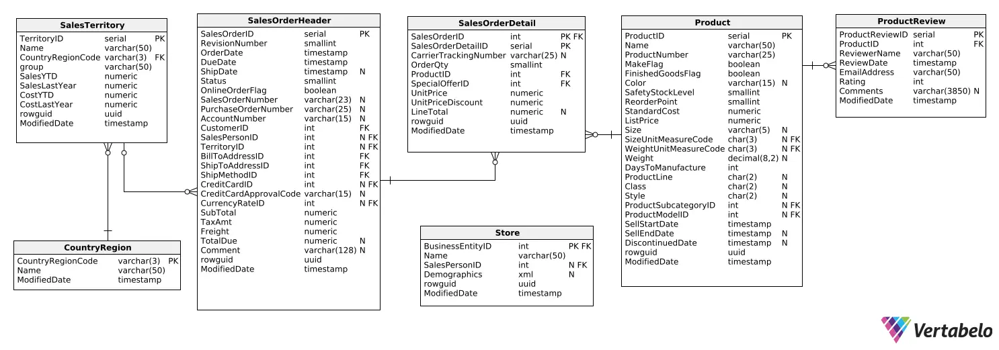

# **Adventure Works - SQL**

Este projeto tem como objetivo criar um painel de vendas para a AdventureWorks, uma empresa fictícia. O painel fornecerá insights valiosos sobre o desempenho das vendas e ajudará na tomada de decisões estratégicas.

## **📋 Funcionalidades**

- Consultas SQL para análise de dados:
  - Seleção, agregação e filtros avançados.
  - Joins entre tabelas.
  - Subconsultas.
  - CTE.
---

## **📁 Estrutura do Banco de Dados**
O AdventureWorks é um banco de dados de exemplo criado pela Microsoft para o SQL Server, neste projeto usaremos sua versão para o MySQL. 
O banco de dados inclui 68 tabelas que descrevem um fabricante fictício de bicicletas e contém dados sobre diferentes tipos de transações 
que ocorrem durante as operações comerciais. Suas tabelas estão organizadas em cinco esquemas principais, cada um representando uma área de operação: Production, Purchasing, Sales, HR e Person.

- **`Schema do Banco de Dados`**

---

## **🛠 Pré-requisitos**

Antes de começar, certifique-se de que você tenha os seguintes requisitos instalados:

- **MySQL**: Você pode baixar e instalar o MySQL Community Server [aqui](https://dev.mysql.com/downloads/).

---

## **📚 Cases**

Esta seção contém exemplos de perguntas analíticas resolvidas com SQL neste projeto, baseadas em cenários do mundo real. Cada case ilustra como os dados podem ser utilizados para responder a questões importantes.

- **Qual é o total de vendas mensais?**
Essa métrica ajudará a identificar tendências sazonais e avaliar o crescimento das vendas ao longo do tempo.
- **Quais são as vendas mensais por país?**
Saber o desempenho por região permitirá identificar mercados-chave e áreas de melhoria.
- **Quais produtos são os mais vendidos?**
Essa análise permitirá reconhecer os produtos mais populares e direcionar os esforços de marketing e produção.
- **Quais lojas têm o melhor desempenho?**
Identificar as lojas de maior desempenho ajudará a replicar boas práticas em outras localidades.
- **Como a receita on-line se compara à receita off-line?**
Entender a tendência de compras virtual ou presencial dos clientes.
- **Qual é o tamanho médio de cada pedido?**
Essa métrica nos dará insights sobre os hábitos de consumo dos clientes.
- **Qual é o valor médio do tempo de vida do cliente em cada país?**
Este indicador é fundamental para entender o valor que cada cliente agrega à empresa ao longo do tempo, segmentado por região.

---

## **💡 Contribuições**

- Sinta-se à vontade para abrir issues ou enviar pull requests. Toda ajuda é bem-vinda!

---
